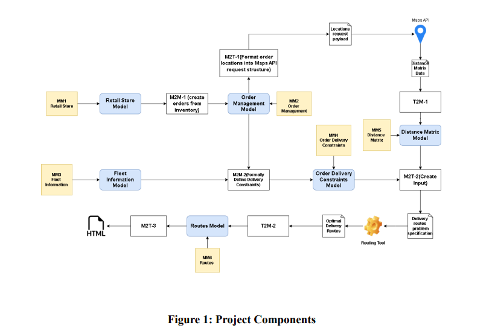

# Optimized Retail Restocking Model-Based Development Project

This repository contains the work for the **Model-Based Development (4DT903)** course at Linnaeus University.  
The project focuses on solving real-world challenges in **retail inventory management and logistics** using a **Model-Driven Engineering (MDE)** approach.

---

## Project Overview
Efficient retail restocking is essential for avoiding stockouts, reducing costs, and maintaining customer satisfaction.  
Our system integrates **Inventory Management** and **Logistics Management** by automating processes such as:

- 📦 **Order generation** – creating restocking orders automatically based on store inventory.  
- 🚛 **Delivery scheduling** – optimizing schedules while considering vehicle capacities and delivery windows.  
- 🗺️ **Route optimization** – generating efficient delivery routes to minimize travel time and costs.  

The result: a system that improves efficiency, reduces manual effort, and ensures timely restocking.

---

## System Architecture
The solution is designed using **metamodels and transformations**:

- **MM1 – Retail Store Model**: Captures store location, items, and delivery windows.  
- **MM2 – Order Management Model**: Structured orders derived from inventory data.  
- **MM3 – Fleet Information Model**: Data about delivery vehicles (capacity, availability).  
- **MM4 – Delivery Constraints Model**: Combines orders + fleet data to define logistics rules.  
- **MM5 – Distance Matrix Model**: Distance and travel time data (via API or simulation).  
- **MM6 – Routes Model**: Optimized delivery routes generated by a routing tool.  

### Transformations
- **M2M**: Model-to-Model transformations (e.g., inventory → orders, orders+fleet → constraints).  
- **M2T**: Model-to-Text transformations (e.g., orders → JSON for APIs, routes → HTML visualization).  
- **T2M**: Text-to-Model transformations (e.g., Maps API → Distance Matrix, Routing Tool output → Routes).  

  
*Figure 1: System architecture, showing models (MM1–MM6) and their transformations (M2M, M2T, T2M) leading to optimized delivery routes.*

---

## Tools & Technologies
- **Eclipse Modeling Framework (EMF)** – for metamodels  
- **QVTo** – for Model-to-Model transformations  
- **Acceleo** – for Model-to-Text transformations  
- **Java** – for Text-to-Model transformations and additional logic  
- **(Optional)** Maps API & external Routing Optimization Tool  

---

## Setup & Execution
1. Install **Java 11+** and **Eclipse IDE** with:
   - EMF (Eclipse Modeling Framework)  
   - QVT Operational (QVTo)  
   - Acceleo  
